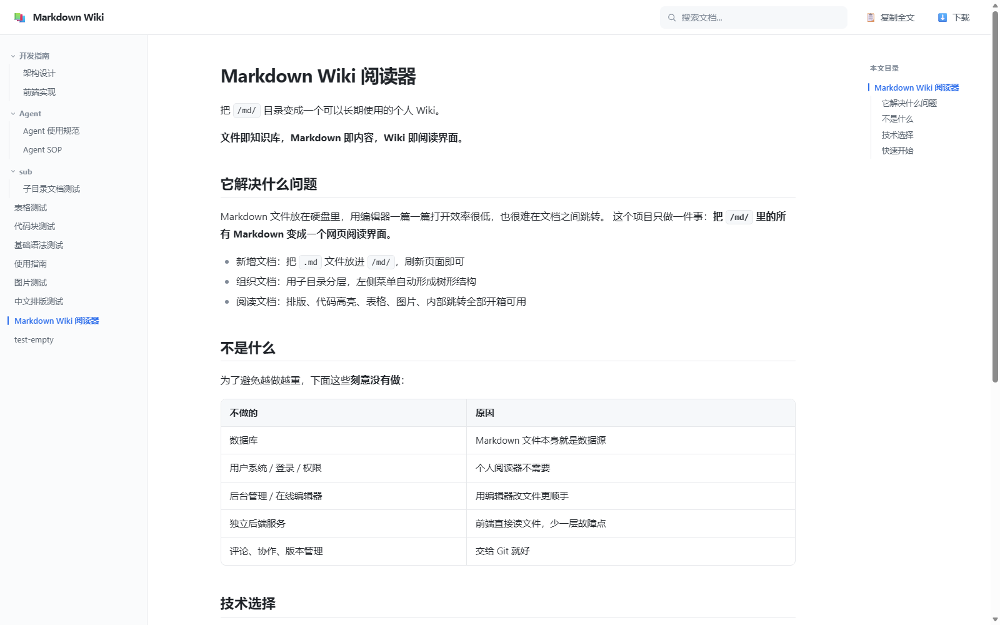

# Markdown Wiki

> 把 `/md/` 目录变成一个可以直接阅读的 Wiki 站点。
> 纯静态、零后端，Markdown 文件本身就是数据源。




---

## 特性

| | |
| --- | --- |
| **文件即数据源** | 往 `md/` 目录丢一个 `.md` 文件、刷新页面，它就出现在左侧菜单里——不改代码、不重新构建 |
| **纯静态** | 部署后是一堆静态文件，Nginx、对象存储、GitHub Pages 都能直接跑，服务器上不需要 Node |
| **完整 Markdown** | 标题、列表、表格、引用、代码块、图片、删除线；代码语法高亮覆盖常见语言 |
| **全文搜索** | 标题与正文一起搜，标题命中排在前面，正文命中带一段上下文 |
| **本文大纲** | 屏幕够宽时右侧出现四级嵌套目录，滚动自动高亮当前章节，点击平滑跳转 |
| **复制与下载** | 顶栏「复制全文」复制纯文本、「下载」导出 Markdown 原文件；每个代码块右上角可单独复制这一段 |
| **响应式** | 桌面三栏、平板收窄、手机抽屉式菜单，表格与长代码横向滚动 |
| **安全渲染** | 所有 HTML 走 DOMPurify 白名单，`<script>`、`onerror=`、`javascript:` 一律剔除 |

## 快速开始

```bash
npm install
npm run dev        # http://localhost:5173
```

把 `.md` 文件放进 `md/` 目录，刷新页面即可。

```bash
npm run build      # 构建到 dist/
npm run preview    # 本地预览构建产物
```

## 使用

### 添加文档

```text
md/
├── 项目介绍.md
├── 开发指南/
│   ├── 架构设计.md
│   └── 前端实现.md
└── images/
    └── architecture.svg
```

支持 `.md` 和 `.markdown`，子目录会原样变成可折叠的菜单分组。**不需要修改任何代码。**

程序启动时先尝试读取服务器的 `/md/` 目录列表，读到什么就显示什么；如果服务器没有开启目录列表（比如对象存储），则回退到构建时打包进 JS 的那份文档快照。

### 菜单标题

优先取正文里第一个一级标题，没有则回退到文件名：

```markdown
# 这是我想要的菜单标题

正文内容……
```

### 路径规则

Markdown 里的相对路径，以**当前文件所在目录**为基准：

```markdown
<!-- 文件位置：md/开发指南/架构设计.md -->
      <!-- → /md/开发指南/images/a.png -->
     <!-- → /md/images/b.png -->
       <!-- 以 / 开头时以 /md/ 为基准 → /md/images/c.png -->
[架构](../开发指南/架构设计.md)   <!-- 站内链接，点击后无刷新切换 -->
```

外链会在新标签页打开。图片放在 `md/` 目录里的任何位置都可以。

## 部署

构建产物是纯静态文件，`npm run build` 之后把 `dist/` 里的内容发布出去即可，服务器上不需要 Node。

### 方式一：托管平台（连仓库，push 自动部署）

Cloudflare Pages、Vercel、Netlify、腾讯云 EdgeOne Pages 都可以，构建配置统一填：

| 配置项 | 值 |
| --- | --- |
| 构建命令 | `npm run build` |
| 输出目录 | `dist` |
| Node 版本 | 由 `.nvmrc` 决定（22） |

### 方式二：自己的服务器（Nginx / 宝塔面板）

服务器上的 `md/` 是你自己的文档，**更新界面时不该去动它**。所以分两步：

```bash
npm run build
python deploy/pack.py      # 生成不含 md/ 的部署包
```

产物是 `wiki-dist.zip` 和 `wiki-dist.tar.gz`，里面只有 `index.html` 和 `assets/`，解压到站点根目录即完成更新，服务器上已有的 `md/` 原封不动。需要连本地文档一起打包时加 `--with-md`。

想让**往服务器 `md/` 目录里丢文件就即时生效**，给 nginx 加两行：

```nginx
location /md/ {
    autoindex on;
    autoindex_format json;
}

# 图片缓存：正则只匹配到文件结尾，不要写成 ^/md/images/，那样会把目录请求也截走
location ~* ^/md/.*\.(png|jpe?g|gif|svg|webp|ico)$ {
    expires 7d;
}
```

`autoindex_format json` 需要 nginx 1.7.9 以上（宝塔、各大面板自带的版本都满足）。没配也能正常跑，只是新增文档后需要重新构建上传。

### 方式三：对象存储

腾讯云 COS、阿里云 OSS 这类没有目录列表能力的托管，传 `dist/` 内容即可（记得开启静态网站模式、把 `index.html` 设为默认首页），新增文档后重新构建上传。

### GitHub Pages

仓库 **Settings → Pages → Source** 选择 `GitHub Actions`，之后推送到 `main` 即自动部署（见 [.github/workflows/deploy.yml](.github/workflows/deploy.yml)）。工作流通过 `configure-pages` 自动解析仓库路径，子路径下的 `base` 不需要手工配置。

### 与 GitHub 保持同步

`md/` 目录是运行时读取的，所以**日常只需要同步它**，不用构建、不用重启任何服务。

```bash
cd /www/wwwroot
git clone https://github.com/yexli/md.git md
```

把 [deploy/sync-wiki.sh](deploy/sync-wiki.sh) 放到服务器上并给执行权限：

```bash
cp md/deploy/sync-wiki.sh /www/wwwroot/sync-wiki.sh
chmod +x /www/wwwroot/sync-wiki.sh
/www/wwwroot/sync-wiki.sh
```

然后在宝塔 **计划任务** 里加一个 `Shell 脚本` 任务定时执行它（比如每 5 分钟）。之后本地写完文档 `git push`，服务器到点自动跟上。

> 脚本用 `rsync --delete` 同步，也就是说 **GitHub 是文档的唯一来源**，不要在服务器上直接改 `md/` 里的文件。

## 项目结构

```text
.
├── md/                          # 唯一的数据源，放 Markdown 的地方
├── docs/preview.png             # README 用的界面截图
├── deploy/
│   ├── pack.py                  # 打包部署产物（默认剔除 md/）
│   └── sync-wiki.sh             # 服务器端同步脚本
├── index.html                   # 页面骨架：顶栏 / 侧栏 / 正文 / 大纲
├── vite.config.js               # 构建配置、目录列表中间件
└── src/
    ├── main.js                  # 入口
    ├── App.js                   # 装配模块，管理 URL、阅读记忆、移动端抽屉
    ├── components/
    │   ├── sidebar.js           # 目录树、当前项高亮、折叠
    │   ├── toc.js               # 右侧大纲：四级嵌套、章节跳转、滚动高亮
    │   ├── search.js            # 标题 + 正文搜索
    │   ├── markdownViewer.js    # 正文渲染、代码复制、站内链接跳转
    │   └── copyButton.js        # 复制与轻提示
    ├── utils/
    │   ├── documentLoader.js    # 读取 /md/（目录列表或构建快照）、构建目录树
    │   ├── markdownRenderer.js  # Markdown → 安全 HTML，标题锚点
    │   └── wikiUrl.js           # ?doc= 状态的读写
    └── styles/main.css          # 全部样式
```

## 技术选型

运行时只有三个依赖，各司其职：

| 依赖 | 用途 |
| --- | --- |
| [`markdown-it`](https://github.com/markdown-it/markdown-it) | Markdown 解析 |
| [`highlight.js`](https://github.com/highlightjs/highlight.js) | 代码语法高亮 |
| [`dompurify`](https://github.com/cure53/DOMPurify) | HTML 白名单过滤 |

构建工具是 Vite，只在开发和构建时使用。目录树、搜索、复制、大纲、URL 状态全部手写，没有引入路由库、状态管理库或 UI 组件库。

## 边界与取舍

- **服务器模式下**启动时会把 `/md/` 里所有文档读进内存（菜单标题和全文搜索都需要），几十到几百篇都很轻；上千篇再考虑改成按需加载。
- **回退模式下**文档内容会打包进 JS，产物约 320 KB（gzip 约 125 KB）。
- **大纲收录到 `####` 为止**，`#####` 和 `######` 不显示，避免目录过碎。
- **不提供编辑、评论、协作、权限**。Markdown 文件在编辑器里改，版本交给 Git。
- 本地改完样式后如果页面没更新，重启一次 `npm run dev`（偶发的样式模块缓存不失效）。

## 许可证

[MIT](LICENSE)
